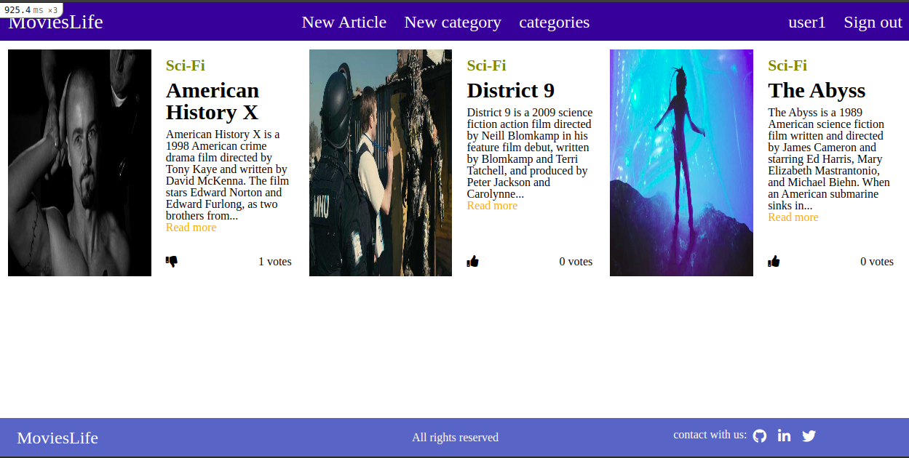

# Private events

> This project displays on the main page the most voted article and below it dsiaplys the categories which are currently available. This application allows you to create new users, new categories and new article with their own picture. Every user who is logged-in can vote for their favorite article.

## :hammer: Built with

- Ruby
- Ruby on Rails
- Ruby gem bundler
- Linters
- VS code

## :hammer: Tested with

- Ruby gem RSpec
- Ruby gem shoulda Matchers
- Ruby gem capybara

## 📝 Pre-requisites

- Ruby ruby 2.7.2p137
- Ruby on Rails 6.1

## :construction_worker: Getting Started

To get a local copy up and running follow these simple steps:

- Go to the [repository page](https://github.com/kcotrinam/movieLife/).
- Press the "Code" button and get the repo link.
- Clone it using git command `git clone <link>`.

## 📝 Setup

1. Open the terminal.
2. On the terminal navigate to the project directory using `cd movieLife/`.
3. Install dependencies using: `bundle install`.
3. If it required: `bundle update`.
4. Migrate the database: `rails db:migrate`.
5. If required run: `yarn install`, and repeate the step 4.
6. Start the application : `rails server`.
7. To Stop the application : Press `Ctrl + c`

## 📝 How to use the application?

- Start the application : `rails server`.

- Open the browser and go to : `http://localhost:3000/`

- Create a new user.

- Log-in with `user1, user2, user3 or user4`.

## :bust_in_silhouette: Author

👤 **Kenvin Cotrina**

- GitHub: [kcotrinam](https://github.com/kcotrinam) 
- Twitter: [@kcotrinam_dev](https://twitter.com/kcotrinam_dev)
- LinkedIn: [KevinCotrina](https://www.linkedin.com/in/kevincotrina/ )

## 🤝 :raised_hand: :raised_hand: Contributions

Contributions, issues, and feature requests are welcome!

Feel free to check the [issues page](https://github.com/kcotrinam/movieLife/issues).

## :muscle: Show your support

Give a ⭐️ if you like this project!

## :grey_exclamation: Acknowledgment

- [Rails Guides](https://guides.rubyonrails.org/)
- [Shoulda Matchers](https://matchers.shoulda.io/docs/v4.4.1/index.html)
- Stack Overflow
- Odin Project.

 ## 📝 License

This project is [MIT](https://github.com/kcotrinam/Private_Events/blob/feature/LICENSE) licensed.
